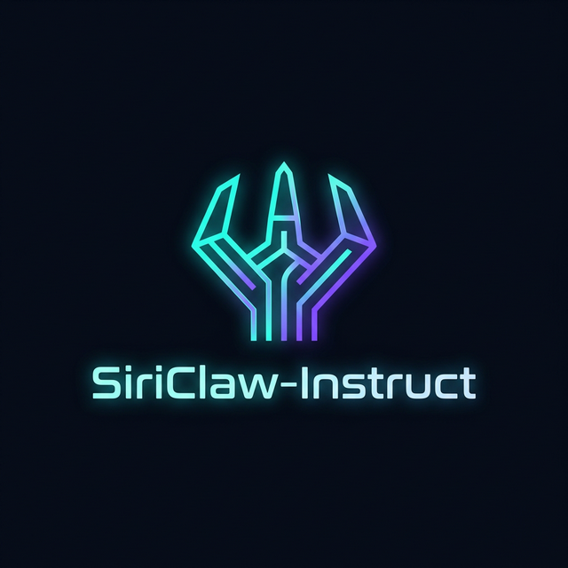
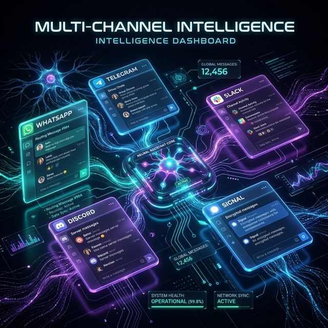
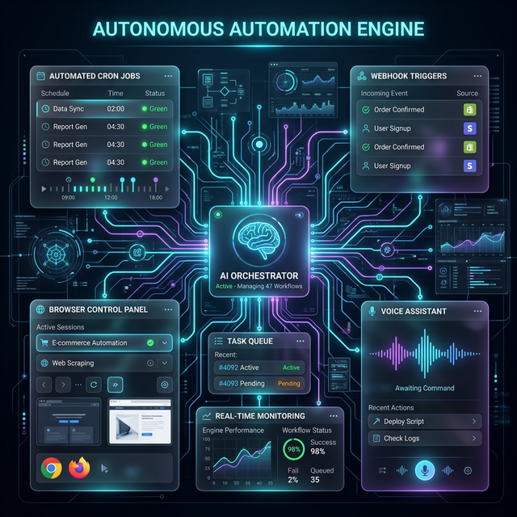
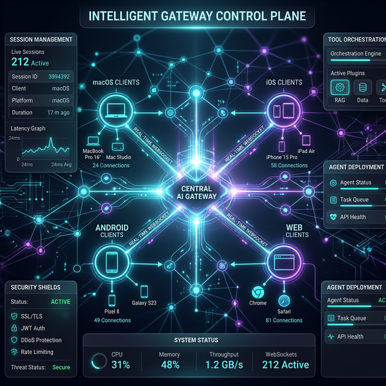

# ⚡ SiriClaw-Instruct — Advanced Personal AI Assistant

<p align="center">
    
</p>

<p align="center">
  <strong>Your Intelligent, Multi-Channel AI Gateway — Run Anywhere, Control Everything</strong>
</p>

<p align="center">
  <a href="LICENSE"></a>
  <a href="#"></a>
  <a href="#"></a>
</p>

---

**SiriClaw-Instruct** is a _personal AI assistant_ you run on your own devices. It answers you on the channels you already use — WhatsApp, Telegram, Slack, Discord, Google Chat, Signal, iMessage, IRC, Microsoft Teams, Matrix, and 10+ more. It can speak and listen, render live canvases, automate workflows, and browse the web — all controlled through a single intelligent gateway.

## 🚀 Quick Start

**Runtime:** Node ≥22 required.

```bash
npm install -g siriclaw-instruct@latest

sirius onboard --install-daemon
```

The onboarding wizard guides you step-by-step through gateway setup, workspace configuration, channel pairing, and skill installation.

```bash
# Start the Gateway
sirius gateway --port 18789 --verbose

# Send a message
sirius message send --to +1234567890 --message "Hello from SiriClaw-Instruct"

# Talk to the assistant
sirius agent --message "Deploy my latest project" --thinking high
```

---

## ✨ Advanced Features

<p align="center">
  
</p>

### 🌐 Multi-Channel Intelligence
Connect to **22+ messaging platforms** simultaneously through a single unified gateway. WhatsApp, Telegram, Slack, Discord, Signal, iMessage, Microsoft Teams, Matrix, and more — all channeled through one intelligent AI brain with per-session isolation and smart routing.

---

<p align="center">
  
</p>

### 🤖 Autonomous Automation Engine
Schedule cron jobs, trigger webhooks, control browsers via CDP, manage Gmail pub/sub events, and orchestrate complex multi-step workflows — all autonomously. The AI agent adapts and executes tasks with minimal human intervention.

---

<p align="center">
  
</p>

### 🛡️ Intelligent Gateway Control Plane
A single WebSocket control plane managing sessions, presence, tools, events, and security. Connect macOS, iOS, Android, and web clients simultaneously. Expose via Tailscale Serve/Funnel for secure remote access.

---

## 🏗️ Architecture

```
WhatsApp / Telegram / Slack / Discord / Signal / iMessage / Teams / Matrix / IRC / ...
               │
               ▼
┌───────────────────────────────────┐
│         SiriClaw Gateway          │
│        (control plane)            │
│      ws://127.0.0.1:18789        │
└──────────────┬────────────────────┘
               │
               ├─ AI Agent (RPC)
               ├─ CLI (sirius …)
               ├─ WebChat UI
               ├─ macOS app
               └─ iOS / Android nodes
```

## 📦 Installation

### From npm (Recommended)

```bash
npm install -g siriclaw-instruct@latest
# or: pnpm add -g siriclaw-instruct@latest

sirius onboard --install-daemon
```

### From Source

```bash
git clone https://github.com/Sirius6907/siriclaw-instruct.git
cd siriclaw-instruct

pnpm install
pnpm ui:build
pnpm build

pnpm sirius onboard --install-daemon
```

## 🔧 CLI Commands

| Command | Description |
|---------|-------------|
| `sirius onboard` | Interactive onboarding wizard |
| `sirius gateway` | Start the Gateway control plane |
| `sirius agent` | Send a message to the AI agent |
| `sirius message send` | Send a message to a contact |
| `sirius doctor` | Diagnose configuration issues |
| `sirius update` | Update to the latest version |
| `sirius channels login` | Link messaging channels |
| `sirius pairing approve` | Approve new DM senders |
| `sirius nodes` | Manage connected device nodes |
| `sirius skills` | Manage agent skills |

## 🔌 Supported Channels

- **WhatsApp** (Baileys) · **Telegram** (grammY) · **Slack** (Bolt) · **Discord** (discord.js)
- **Google Chat** · **Signal** (signal-cli) · **BlueBubbles** (iMessage) · **iMessage** (legacy)
- **IRC** · **Microsoft Teams** · **Matrix** · **Feishu** · **LINE**
- **Mattermost** · **Nextcloud Talk** · **Nostr** · **Synology Chat** · **Tlon**
- **Twitch** · **Zalo** · **Zalo Personal** · **WebChat**

## 🛡️ Security

- **Default:** Tools run on host for the main session
- **Sandbox mode:** Non-main sessions run inside per-session Docker sandboxes
- **DM pairing:** Unknown senders receive a pairing code — approve with `sirius pairing approve`
- **Tailscale integration:** Serve (tailnet-only) or Funnel (public) with auth

## ⚙️ Configuration

Minimal `~/.siriclaw-instruct/siriclaw-instruct.json`:

```json5
{
  agent: {
    model: "anthropic/claude-opus-4-6",
  },
}
```

## 📱 Companion Apps

- **macOS** — Menu bar control, Voice Wake, Push-to-Talk, WebChat, debug tools
- **iOS** — Canvas, Voice Wake, Talk Mode, camera, screen recording, Bonjour pairing
- **Android** — Chat, voice, Canvas, camera, screen capture, device commands

## 🧠 Skills & Workspace

- Workspace root: `~/.siriclaw-instruct/workspace`
- Skills: `~/.siriclaw-instruct/workspace/skills/<skill>/SKILL.md`
- Injected prompt files: `AGENTS.md`, `SOUL.md`, `TOOLS.md`
- **SiriHub** — Skill registry for automatic skill discovery and installation

## 🗂️ Key Subsystems

- **Gateway WebSocket Network** — Single WS control plane for clients, tools, and events
- **Browser Control** — Managed Chrome/Chromium with CDP control
- **Canvas + A2UI** — Agent-driven visual workspace
- **Voice Wake + Talk Mode** — Wake words on macOS/iOS, continuous voice on Android
- **Nodes** — Camera, screen recording, location, notifications, system commands
- **Multi-Agent Routing** — Route channels/accounts to isolated agents

## 📄 License

MIT License — Copyright (c) 2026 Sirius6907

See [LICENSE](LICENSE) for details.
